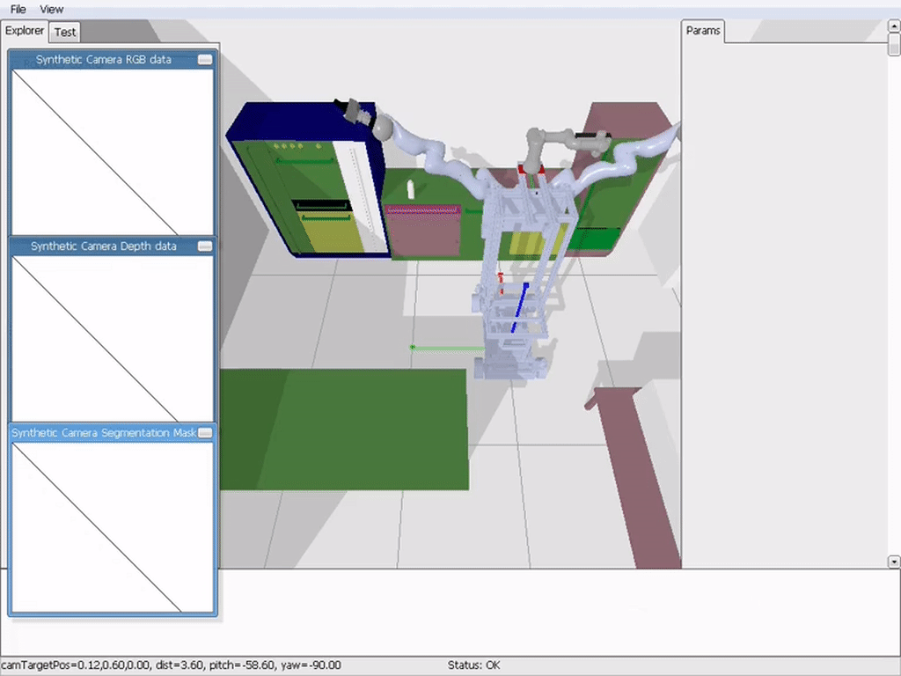

# Welcome to the PyCRAM package

[](https://github.com/cram2/pycram/actions/workflows/new-pycram-ci.yml/badge.svg)
[](https://github.com/cram2/pycram/actions/workflows/notebook-test-ci.yml/badge.svg)


PyCRAM is a plan executive for cognitive robotic designed to facility the execution of high-level plans on
robots in partially observable environments. To achieve this goal PyCRAM provides a set of tools for the design,
implementation and execution of high-level plans. The framework is designed to be modular and extensible, allowing
users to easily add new functionality and robots to the system to suit their needs.


## Installation

The simplest way to install PyCRAM is via the installation script:

```bash
curl -s https://raw.githubusercontent.com/cram2/pycram/dev/scripts/install.sh | bash
```

For more information on installing PyCRAM and a manual installation guide please refer to the guide [here](https://pycram.readthedocs.io/en/latest/installation.html).


## Live Demo

**If you want to test out PyCRAM right away, you can do that in the browser in our virtual research
building [here](https://vib.ai.uni-bremen.de/page/fallschool/)**

## Simple Demonstration

PyCRAM allows the execution of the same high-level plan on different robot platforms. Below you can see an example of
this where the plan is executed on the PR2 and the IAIs Boxy.

|               Boxy                |           PR2           |
|:---------------------------------:|:-----------------------:|
|  |  |


## Documentation

The latest version of the documentation is hosted on Read the
Docs [here](https://pycram.readthedocs.io/en/latest/index.html).

The documentation can be found in the `doc` folder, for instructions on how to build and view the documentation please
take a look at the respective `README` file.

## Examples

Examples of features can be found either in the documentation under the [Examples](https://pycram.readthedocs.io/en/latest/notebooks/intro.html) Section or in the `examples` folder.
The examples in the `examples` folder are Jupyter Notebooks which can be viewed and executed, for more information
how to do that take a look at the respective `README` file.

# Virtual Building

Within our virtual building, you can find a variety of labs and examples that showcase the use of PyCRAM. These
resources are available at our [Labs page](https://vib.ai.uni-bremen.de/page/labs/). They are designed to help you
understand and experiment with PyCRAM's capabilities.

## Setting Up Your Own Lab

If you're looking to set up your own lab within the virtual building, please refer to the `vrb` branch of this
repository. It includes detailed instructions and templates to guide you through the process.
