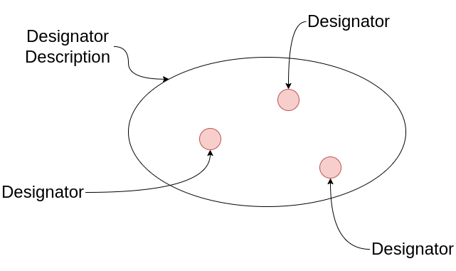

===========
Designators
===========

Designators are CRAMs and PyCRAMs way of representing actions, motions, objects and locations.

In general, PyCRAM-Designators consist of a description and a specified element.
Descriptions describe sets of designators and designators are one thing in the described set.
For example, such a description could describe an action where the robot moves to a location
from where it can grasp an object. The specific location in this case is not relevant as long
as the robot can reach the object.

The designator description will be resolved during runtime which results in a designator with
specific parameter, the resulting designator can also be performed to let the robot perform the
desired behaviour.

To stay on the example of an action designator which should move the robot to a location from
where it can grasp an object, we will create a NavigateAction description with a list of possible
poses.

.. code-block:: python

    poses = [Pose([1, 0, 0], [0, 0, 0, 1]), Pose([1.2, 0.2, 0], [0, 0, 1, 0])]
    NavigateAction(target_locations=poses)

This is a description of an action which moves the robot to a pose in the environment.
In this case the description describes a set of action designators which have a pose of the ``poses``
list as target location.

By resolving the description it will return a single designator with specific parameter.
This can look like this:

.. code-block:: python

    designator = NavigateAction(target_locations=poses).resolve()

The resolver will check the available parameter and return a designator with appropriate parameter
which can then be performed. The designator returned by the resolver will always be a sub-class
of the description, in this way the designator can be assigned the type of action it performs.
The resolved designator can also contain new parameter which might be relevant for performing the
designator and will be inferred while resolving. A resolved action designator for a navigate
action looks like this:

.. code-block:: python

    NavigateAction(robot_position=(Pose([0.0, 0.0, 0.0] [0.0, 0.0, 0.0, 1.0]), target_location=Pose([1, 0, 0], [0, 0, 0, 1]))

A visual representation of the whole idea of designator and designator descriptions can be
seen in the following image.

There are four types of designators in PyCRAM:

 - :mod:`pycram.designators.action_designator`
 - :mod:`pycram.designators.object_designator`
 - :mod:`pycram.designators.location_designator`
 - :mod:`pycram.designators.motion_designator`

Object Designator
=================

Object designators represent objects in (simulated) world.
The description of object designators can take names and types that the object should match.
The :meth:`~pycram.designator.ObjectDesignatorDescription.ground` method returns an object with all
its data attached that matches the description.
The :meth:`~pycram.designator.ObjectDesignatorDescription.__iter__` method iterates over all objects
that match the description.

Contributing Object Designators
-------------------------------
Object Designators should always be part of an object designator description.
The general class structure is seen in :mod:`~pycram.designator.ObjectDesignatorDescription`.
New object description need to inherit from the general object description. If the object they ground to differs from
the base object, a `dataclass <https://docs.python.org/3/library/dataclasses.html>`_. should be created inside the new
description. The dataclass is one element that matches the description.
If ORM logging of the new objects is wanted a ``to_sql()`` and ``insert()`` method has to be implemented
(see :ref:`orm` for more details).

Action Designator
=================
Action designators describe complex actions that are executable for an agent. Action designators can be seen as higher
level plans that include failure handling and parametrization.
An action designator description always takes the parameter as a list of possible parameter, when
resolving the description to a single designator one parameter out of the given list will be picked.

Motion Designator
=================
Motion designators describe atomic actions that are executable for an agent. In contrast to action
designators there is no failure handling or other action designators. Furthermore, the :meth:`~pycram.designator.MotionDesignatorDescription.Motion.perform`
method passes the resolved motion designator to the respective Process Module for execution on the robot.

Another difference to action designator is that motion designators only take a single parameter instead of a
list, this parameter is also strictly typed.

Location Designator
===================
Location designator describe a set of locations in regards to specific constrains. These constrains can be things
like ``reachable`` or ``visible``. The pose returned by a location designator is a single pose of the set defined
by the constrains given to the location designator description.

Similar to object designator poses location designator also a :meth:`~pycram.designators.location_designator.CostmapLocation.__iter__`
method which can iterate over all possible solutions for this description.

Creating your own Designator
============================
Creating your own designator is fairly easy, you only need to extend the base class of the respective description.

 - :mod:`~pycram.designator.ActionDesignatorDescription`
 - :mod:`~pycram.designator.ObjectDesignatorDescription`
 - :mod:`~pycram.designator.LocationDesignatorDescription`
 - :mod:`~pycram.designator.BaseMotion`

Afterwards you need to implement your own ``ground`` method which is the default resolver and for location and object
designator it makes sense to also implement a ``__iter__`` method. The ``ground`` and ``__iter__`` methods should return
the designator sub-class so you also need to implement these with the parameter your designator needs.

The sub-class can already contain some parameters, this is usually the case if the parameter is the same for every designator
of this type. For example, :class:`~pycram.designator.LocationDesignatorDescription.Location`
contains a ``pose`` parameter since every location designator contains a resolved pose.

For action and motion designator the sub-class is also the place where the ``perform`` method is written which contains
the behaviour of the designator.

