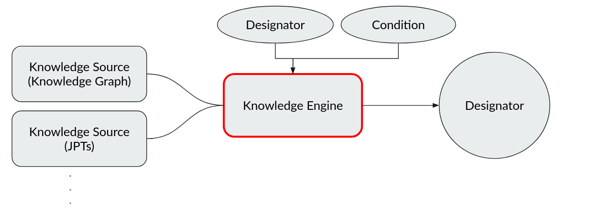
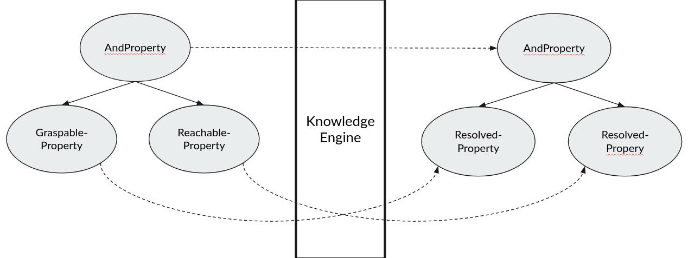

=========
Knowledge
=========

To be able to perform tasks in unknown environments a robot needs to have a way to reason and access
knowledge about the world. This knowledge can be represented in different ways and formats. In this
chapter we will discuss how PyCRAM access different kinds of knowledge and integrates them with
action designators.

-------
Concept
-------
The concept of knowledge in PyCRAM is based on the idea that knowledge can be represented in different ways and provided
from different sources which can be specialized for different tasks. These different sources of knowledge are implemented
behind a common interface which provides a set of methods to query the knowledge. This architecture can be seen in the
following image:

The methods provided by the knowledge sources, are called "properties" since they are used to reason about the properties
of entities in the world. Properties can be combined to create more complex expressions which describe conditions
that have to be true at the time an action designator is executed. Let's look at an example explaining this:

.. code-block:: python

    GraspableProperty(ObjectDesignator(...))
    & ReachableProperty(Pose(....))

In this example, we have two properties, one that checks if an object is graspable and one that checks if a pose is reachable.
The `&` operator is used to combine the two properties into a single property that checks if both conditions are true at
the same time. This combined property stems from the PickUpAction where the object a robot wants to pick up has to be
reachable for the robot as well as being able to fit into the end effector of the robot.

Since knowledge sources are usually specialized for a certain task, they do not need to be able to implement all methods
of the interface. This leads to a lot of knowledge sources which all implement a subset of the methods, therefore no
knowledge source can be used to answer all questions. To solve this problem, PyCRAM has a central interface for processing
the combined properties and querying the knowledge sources called the "KnowledgeEngine". The job of the KnowledgeEngine
is to take a combined property and resolve the individual properties to the available knowledge sources which implement
the methods needed to answer the question. The resolved properties are then combined in the same way as the input property
and evaluated.

This image shows the process of resolving the properties through the knowledge engine:

-----------------
Knowledge Sources
-----------------
Knowledge does not have a unified form or representation, it can be available as an SQL database, a Knowledge Graph,
a simple JSON file,  etc. To be able to handle a multitude of different representations of knowledge, PyCRAM uses the
concept of Knowledge Sources. A Knowledge Source is a class that implements a set of methods to access knowledge. Therefore,
PyCRAM does not care how the knowledge is accesses or where it is from as as long as the Knowledge Source implements the
abstract methods.

The methods that a Knowledge Source must implement are some basic methods to manage connecting to the knowledge itself
and more importantly, methods to query the knowledge. Which methods are provided by each knowledge source decides each
knowledge source on its own by using the respective property as a mix-in of the knowledge source. The properties curren
available and which a knowledge source can implement are:

- `GraspableProperty`: Checks if an object is graspable
- `ReachableProperty`: Checks if a pose is reachable
- `SpaceIsFreeProperty`: Checks if a space is free for the robot to move to
- `GripperIsFreeProperty`: Checks if the gripper is free to grasp an object
- `VisibleProperty`: Checks if an object is visible

If you want to learn more about the implementation of a Knowledge Source, you can look at the following example:

:ref:`Knowledge Source example<knowledge_source_header>`

----------------
Knowledge Engine
----------------
The Knowledge Engine is the central component in PyCRAM to reason about the world. It takes a combined property and
resolves the individual properties to the available knowledge sources which implement the methods needed to answer the
question.

While the properties are resolved they also infer parameter which are needed to execute the action but may not be defined
in the action designator description. For example, the PickUpAction needs an arm to pick up an object with, however, the
arm does not need to be defined in the action designator and can be inferred from the properties and the state of the
world.

After the properties are resolved, evaluated and the parameters are inferred, the Knowledge Engine grounds the action
in the belief state and tests if the found solution is valid and can achieve the goal. If the solution is valid, the
Knowledge Engine returns the solution and the action designator is performed.