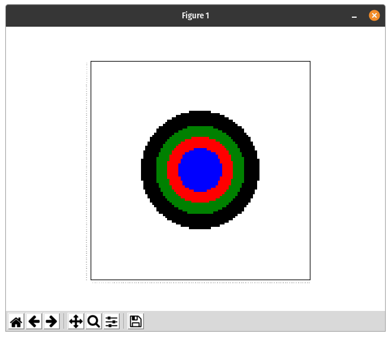
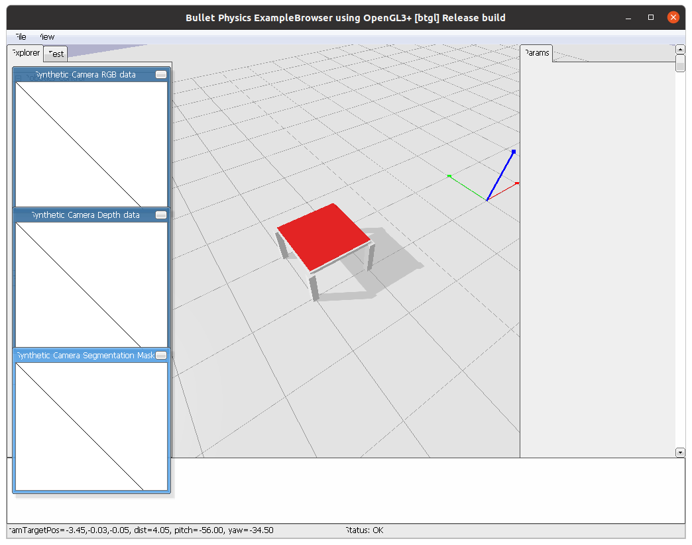
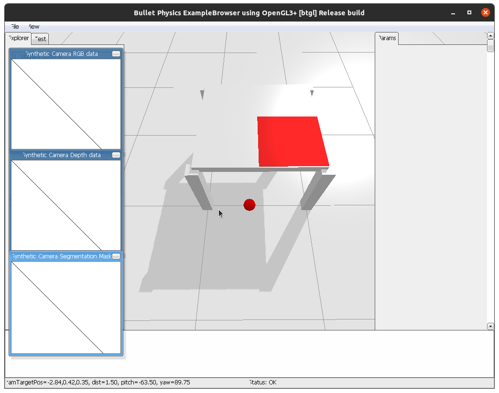

========
Costmaps
========

Costmaps are way to describe positions in a defined area around a pose with respect to certain constrains. For example,
there is a costmap which contains every position from which a certain object is visible.

In PyCRAM these costmaps are used to dynamically generate poses for certain criteria like visibility, reachability
or occupancy. So if you, for example, want to find a position from where the robot can see a certain object you would
generate a costmap for the visibility and one for occupancy. These costmaps can then be merged with one another and
result in a costmap which contains every position from which the object is visible and where the robot can stand.

Currently there are four types of costmaps implemented:

    * Occupancy Costmap
    * visibility Costmap
    * Gaussian Costmap
    * Semantic Costmap

-----------------
Occupancy Costmap
-----------------
Occupancy costmaps represent all positions that don't have any objects positioned above them. Meaning the robot can
stand there without colliding with anything. The occupancy costmap can be generated in two ways, either by using a map
provided by the ROS map_server or by directly generating it from the BulletWorld. Additionally user can specify a value
by which obstacles should be inflated creating a boundary around obstacles to avoid colliding with them. Below you can
see the constructor for the Occupancy Costmap if it is generated from the ROS map_server.

.. code-block:: python

    from pycram.costmaps import OccupancyCostmap

    occupancy = OccupancyCostmap(0.2, True)

In this case is it enough to specify the value by which obstacles should be inflated as well as the boolean which says
that this costmap should be generated from the ROS map_server. The value is given in metre meaning 0.2 translates to 20
centimetre. Since the costmap that generated in this way is rather large and usually encompasses the whole environment
the robot is operating in there is a method that can cut out a smaller map from the whole occupancy map. This is done
to get a local costmap that is centered around the point of interest. This is also necessary since the merging of
costmaps requires that all given costmaps have the same size.

.. code-block:: python

    from pycram.datastructures.pose import Pose

    local_ocupancy = occupancy._create_sub_map(Pose([1, 0.3, 0]), 200)

The parameter given to the method are the new origin around which the local costmap is centered and the size the costmap
should have.

In the case where the costmap is generated from the BulletWorld the constructor gets more parameter, specifying the
exact dimensions of the costmap.

.. code-block:: python

    from pycram.costmaps import OccupancyCostmap
    from pycram.datastructures.pose import Pose

    occupancy = OccupancyCostmap(distance_to_obstacle=0.2,
                                 from_ros=False,
                                 size=200,
                                 resolution=0.02,
                                 origin=Pose([1, 0.3, 0]))

The given parameter are:

    * The inflation radius
    * The the costmap should not be created from Ros
    * The size
    * The resolution
    * The origin

The inflation radius was already explained above while the boolean just specifies if the cosmap should be created from
the ROS map_server or the BulletWorld. The size specifies the height and width of the costmap, costmaps are usually
created as a square. The resolution determines how many metre a pixel in the costmap represents in the real world. The
origin is the pose, around which the costmap is centered.

You can see an image of the final Occupancy costmap with an inflation radius of 0.2 m below.

.. image:: _static/images/occupancy_costmap.png

------------------
Visibility Costmap
------------------

Visibility costmaps show the visibility for a specific position in a restricted area. This means every position from
which the robot can see the position given as the map origin.

The visibility costmap is created by taking depth images from the origin
position of the costmap and then checking which positions are occluded by other objects. Essentially, this specifies
how far you can look from the object in all direction. Afterwards, a 2D representation is created from these depth images.

The constructor for the visibility costmap gets the following parameter

.. code-block:: python

    from pycram.costmaps import VisibilityCostmap
    from pycram.datastructures.pose import Pose

    visibility = VisibilityCostmap(min_height=1.27,
                                   max_height=1.6,
                                   size=200,
                                   resolution=0.02,
                                   origin=Pose([1, 0.3, 0]))

The parameter for the constructor are:

    * Minimal height of the camera
    * Maximal height of the camera
    * Size of the costmap
    * Resolution of the costmap
    * Origin of the costmap

The minimal and maximal height of the camera specify the height of the camera from the ground. This is in case the
camera can move, either if the torso of the robot moves or the camera itself is movable. Since the movement of the camera
gives the robot more opportunities to see the pose this is taken into account with these parameters. If the camera
on the robot can not change its height, just set both parameter to the height of the camera.

Size of the costmap is the height and width of the resulting costmap. Resolution is how many metre a pixel in the
costmap represents in the real world. Origin is the position the costmap is centered around as well as the position
for which the visibility is calculated.

A simple visibility costmap with two objects can be seen below.

.. image:: _static/images/visibility_costmap.png

----------------
Gaussian Costmap
----------------

A gaussian costmap is essentially a 2D gauss distribution with its peak at the centre of the the costmap. Gaussian
costmaps are, for example, used to approximate reachability of objects. The idea being that to reach an object the
robot has to be relatively close to the object to reach it.

Since all other objects use just 0 or 1 to represent if an entry in the costmap is valid according to their respective
constraint Gaussian Costmaps add some variance to highlight a certain point. This is especially useful when keeping in
mind that sampling from the costmap is based on the maximum likelihood, meaning the cells with the highest value will be
sampled first.

.. code-block:: python

    from pycram.costmaps import GaussianCostmap
    from pycram.datastructures.pose import Pose

    gauss = GaussianCostmap(mean=200,
                            sigma=15,
                            resolution=0.02,
                            origin=Pose([1, 0.3, 0]))

The parameter given to the gaussian costmap are:

    * Mean of gaussian distribution
    * Sigma of the gaussian distribution
    * Resolution of the costmap
    * Origin of the costmap

The mean is the mean value of the gaussian distribution as well as the size of the resulting costmap. Sigma is the
sigma value of the gaussian distribution which is contained in the costmap. Resolution and origin are the same as for
other costmaps.

A plot of the gaussian costmap can be seen below. This is a matplotlib plot of the costmap to better show the
distribution.

----------------
Semantic Costmap
----------------

Semantic costmaps allow to specify a costmap based on a semantic description of the environment. This means that the
costmap is created given an object and a link in the belief state. The costmap is created by taking the bounding box of
the given link and creating a distribution above it.

The semantic costmap is meant to be used to create poses for symbolic descriptions of the environment. For example, if
the robot should place an object on the table but no specific pose is given, the semantic costmap can be used to create
a costmap that contains all possible positions on the table. A sample of this costmap can then be used to parametrize
the plan.

A semantic costmap is created by specifying the object and the link in the belief state. Optionally the resolution of
the resulting costmap can also be specified.

.. code-block:: python

    from pycram.costmaps import GaussianCostmap

    semantic = SemanticCostmap(object=apartment,
                               link="table_area_main",
                               resolution=0.02)

The image below show a semantic costmap created for a table.

--------------------------
Algebraic Semantic Costmap
--------------------------

A algebraic semantic costmap is a special for of a semantic costmap. It is created using `Random Event <https://random-events.readthedocs.io/en/latest/intro.html>`_.
This allows to slice the created costmap to specify the area of interest. For example, the costmap is created above the
whole table but we only want to place an object on the lower right area or the outer perimeter of the table. This can be
done as follows:

.. code-block:: python

    from pycram.costmaps import GaussianCostmap

    semantic = AlgebraicSemanticCostmap(object=apartment,
                                        link="table_area_main")
    semantic.valid_area &= semantic.right()
    semantic.valid_area &= semantic.bottom()

The result of this operation can be seen in the image below.

-------------------------
Visualization of Costmaps
-------------------------

Costmaps can be visualized in the BulletWorld, for this every costmap contains the method “visualize” which can be
directly called for the costmap.

.. code-block:: python

    visibility.visualize()

To make the visualization of a costmap disappear from the BulletWorld you can simply call the “close_visualization”
method for the same costmap.

.. code-block:: python

    visibility.close_visualization()

The images for the occupancy and visibility costmap show the visualisation in the BulletWorld with this method.
Debugging Visualization.

For a more comprehensive visualization of the costmao the is the method “plot_grid” in the costmap.py file. This
creates a matplotlib plot of the 2D numpy array which represents the costmap. The “plot_grid” method can be called as
follows:

.. code-block:: python

    from pycram.costmaps import VisibilityCostmap
    from pycram.datastructures.pose import Pose

    visibility = VisibilityCostmap(1.27, 1.6, 200, 0.02, Pose([1, 0.3, 0]))
    plot_grid(visibility.map)

The image for the gaussian costmap shows the plot of matplotlib.
Merging of Costmaps.

It is possible to merge different costmaps to create a costmaps that contains positions that adhere to more than one
constraint. For example, if you merge a visibility and occupancy costmap you get a costmap that contains positions
where the robot can stand and see a specific point.

To be able to merge different costmaps there are a few restrictions that you have to follow. The restrictions are:

    * The costmaps must have the same size
    * The costmaps must have the same origin
    * The costmaps must have the same resolution

These restrictions make it much easier to merge costmaps and also reduce the probability of errors occurring in the
resulting costmap. Since all for all costmaps these parameter can be set when creating them, it shouldn't pose a
problem to match these parameter for all created costmaps, making them able to be merged.

The one exception for this is the occupancy costmap when generated from the ROS map_server, in this case all
parameter are already decided by the map_server. However, for this case there is the “_create_sub_map” method which
creates a local costmap from the bigger occupancy costmap. The only thing that can not be fixed with this is the
resolution of the occupancy map, which stays the same for the local costmap. But then again, since when creating the
other costmaps a resolution can be specified the resolution given for the other costmaps can be adjusted to the one
of the occupancy costmap.
