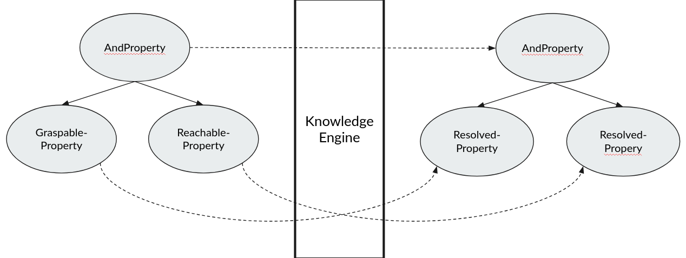
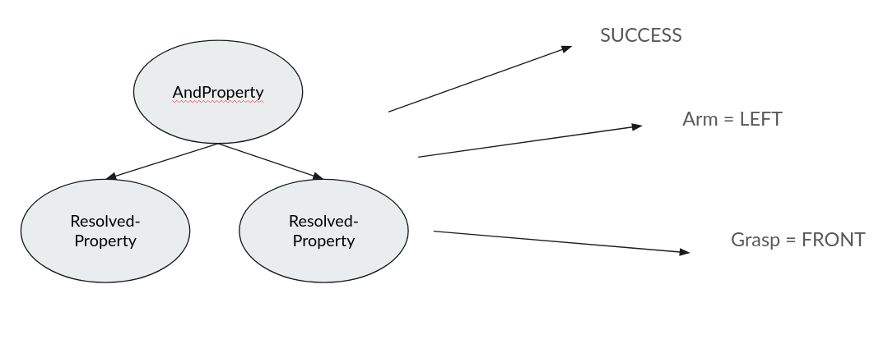

=======================
Knowledge and Reasoning
=======================

The knowledge engine is able to infer parameters of a designator description from the context given by the properties
attached to its parameters. Since the properties are defined for the parameters of a designator description they add
semantic information to the designator description parameters. The knowledge engine is able to utilize this information
to infer the value of a parameter from the context.

Inference is done very similar to the normal reasoning process where the property function of the designator description
is first resolved and then evaluated. The difference is that we now not only look at the result (if the properties are
satisfied or not) but also a the possible parameter solutions that are generated while reasoning.

We start again by taking the properties of of the designator description and resolve them. This was already explained in
the :ref:`Knowledge <knowledge>` documentation.

We then evaluate the properties and generate the possible parameter solutions.

As can be seen in the picture above the major part of inferring missing parameter is done by the Knowledge Source with
the semantic context provided by the properties. The magics consists now of matching the inferred parameter from the
Knowledge Sources with the parameter of the designator description.

-------------------------------
Matching of inferred parameters
-------------------------------

The parameter that are inferred by the Knowledge Source during reasoning need to be matched to the designator to be
usable in the execution of a designator. Matching of the inferred parameters is kinda ambiguous since the parameter are
provided by the Knowledge Source as a dictionary with a name and the value. Therefore the name given in the dictionary
might not match the designator.

To solve the issue of aligning the inferred parameters from the Knowledge Source with the parameters of the designator
we employ two methods. The first is to match the names in the dictionary with the names of the parameters of the
designator. This is most reliable when the return from the Knowledge Source tries to adhere to the conventions of the
designator description.
The second method is to match the type of the inferred parameter with the type annotations in the designator. While this
seems like the more reliable method, it cloud happen that a designator has multiple parameters of the same type. In this
case the matching might not yield the correct result, since the first found parameter of the designator is matched with
the parameter of the Knowledge Source.

